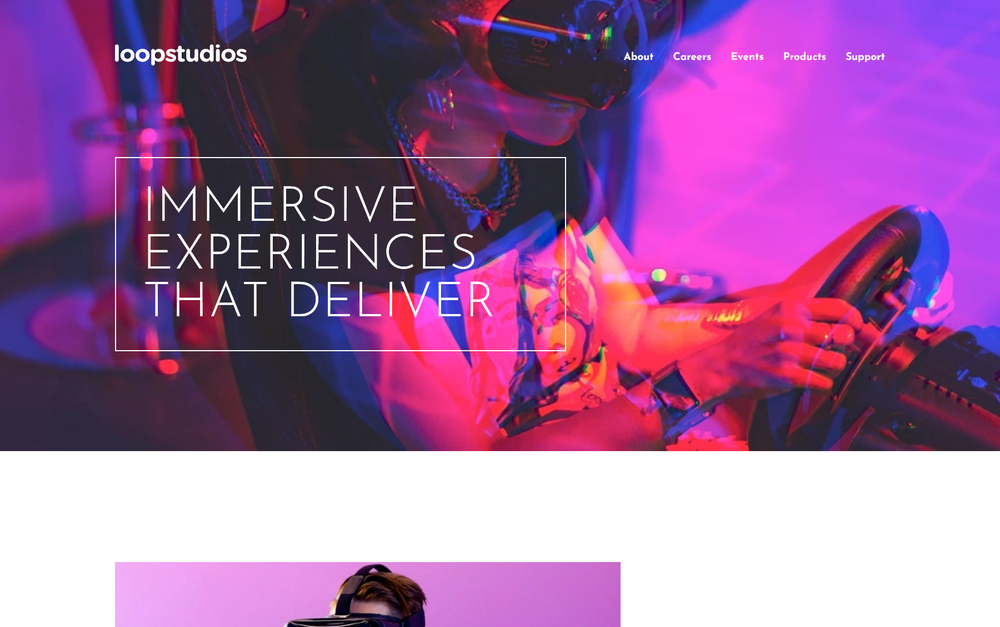
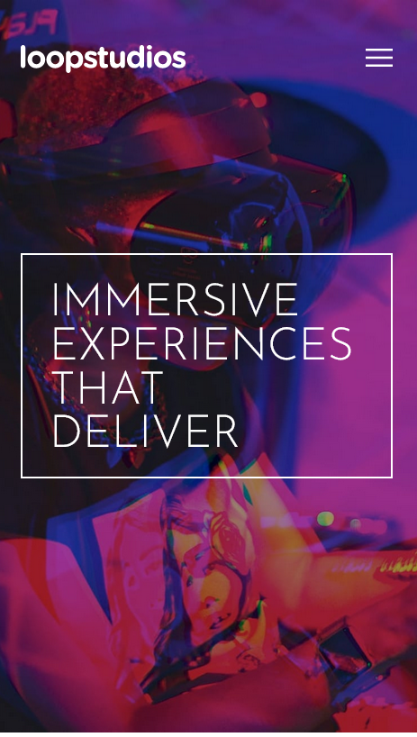

# Frontend Mentor - Loopstudios landing page solution

This is a solution to the [Loopstudios landing page challenge on Frontend Mentor](https://www.frontendmentor.io/challenges/loopstudios-landing-page-N88J5Onjw). Frontend Mentor challenges help you improve your coding skills by building realistic projects. 

## Table of contents

- [Overview](#overview)
  - [The challenge](#the-challenge)
  - [Screenshot](#screenshot)
  - [Links](#links)
- [My process](#my-process)
  - [Built with](#built-with)
  - [What I learned](#what-i-learned)
  - [Continued development](#continued-development)
- [Author](#author)


## Overview

### The challenge

Users should be able to:

- View the optimal layout for the site depending on their device's screen size
- See hover states for all interactive elements on the page

### Screenshot





### Links

- Solution URL: [Github repository](https://github.com/uvdevelop26/loopstudios-landing-page)
- Live Site URL: [Github live site](https://uvdevelop26.github.io/loopstudios-landing-page/)

## My process

### Built with

- Semantic HTML5 markup
- CSS custom properties
- Flexbox
- CSS Grid
- Mobile-first workflow
- [Sass](https://sass-lang.com/) 


### What I learned

Mixings are reusable blocks of code that can accept arguments and output CSS rules.

```CSS SASS
@mixin md {
  @media (min-width: map-get($breakpoints, "md")) {
    @content;
  }
}

```

### Continued development

I'll continue to develop with SASS, it was a lot of fun and there is a so much to learn yet


## Author

- LinkedIn - [Ubaldo Villalba](https://www.linkedin.com/in/ubaldo-villalba-6727a021a/)
- Frontend Mentor - [@uvdevelop26](https://www.frontendmentor.io/profile/uvdevelop26)


